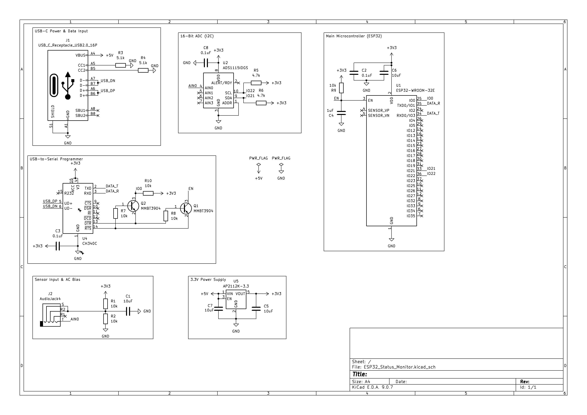
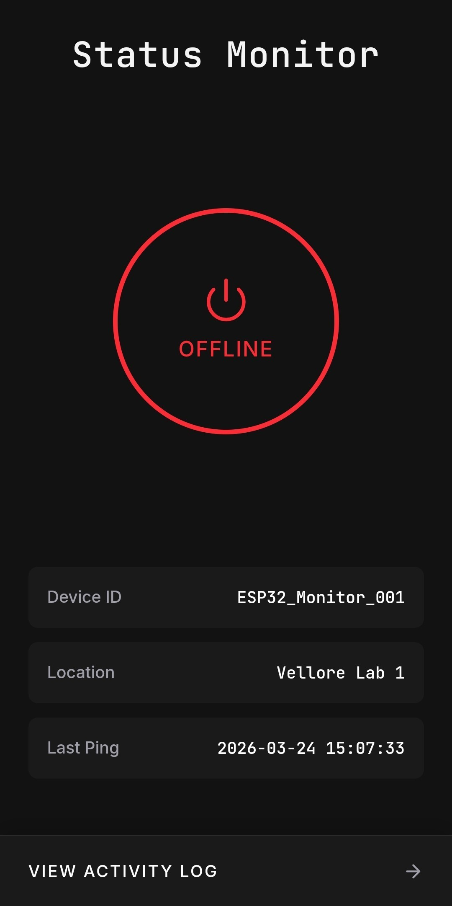
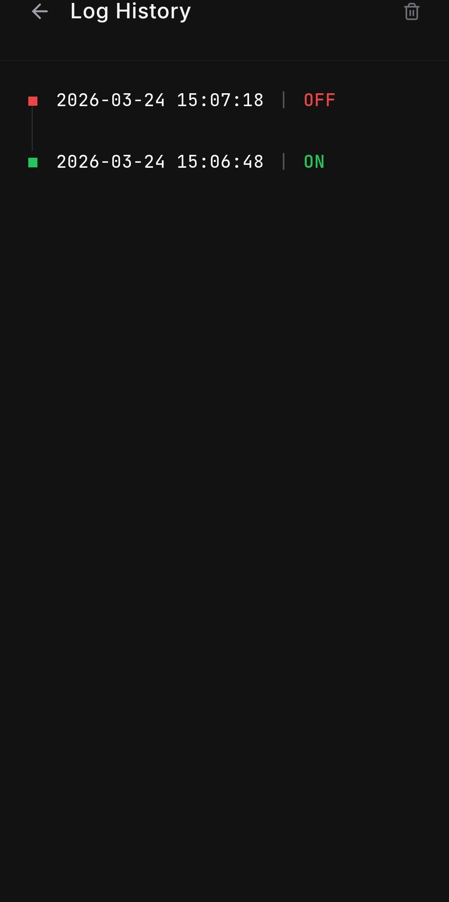

# Real-Time IoT Device Monitoring System

## 📌 Project Overview
This project is an end-to-end IoT solution designed to remotely monitor the real-time operational status of heavy electrical appliances. It captures precise current data at the edge and visualizes the live status through a custom mobile application.

## ⚙️ System Architecture
* **Edge Node:** Built with an ESP32 microcontroller.
* **Sensing:** Utilizes an SCT-013 AC current sensor and a custom RC circuit.
* **Signal Processing:** Integrates a 16-bit ADC for high-precision data capture.
* **Backend:** Google Firebase Realtime Database handles live data telemetry.
* **Frontend:** Custom mobile application for status visualization.

## 📂 Repository Structure
* `/firmware`: Contains the C++ firmware (`main.cpp`) for the ESP32.
* `/mobile_app`: React Native/TypeScript source code (`.tsx`) and UI screenshots for the visualization app.
* `Schematic.png`: The circuit schematic for the hardware assembly.

## 📸 Project Gallery

### Hardware Schematic

### Mobile App Interface

